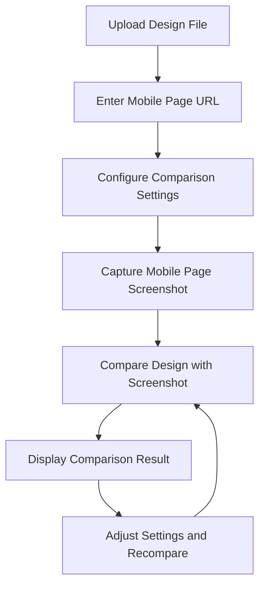

## 1. Product Overview
设计图比对工具是一个用于比较PSD或图片设计图与移动端页面还原度的Web应用。
- 帮助设计师和开发者快速识别设计与实现之间的差异，提高开发效率和设计还原度。
- 目标用户为前端开发者、UI/UX设计师和产品经理，市场价值在于减少设计还原偏差，提升用户体验一致性。

## 2. Core Features

### 2.1 User Roles
| Role | Registration Method | Core Permissions |
|------|---------------------|------------------|
| Normal User | No registration required | Upload design files, compare with mobile page, view comparison results |

### 2.2 Feature Module
1. **Home page**: File upload section, comparison settings, result display area
2. **Comparison result page**: Side-by-side comparison, difference highlighting, measurement tools

### 2.3 Page Details
| Page Name | Module Name | Feature description |
|-----------|-------------|---------------------|
| Home page | File upload section | Allow users to upload PSD or image files as design references |
| Home page | Comparison settings | Configure comparison parameters such as device type, screen size, and comparison sensitivity |
| Home page | Result display area | Show the comparison result with highlighted differences |
| Comparison result page | Side-by-side comparison | Display design reference and mobile page side by side for visual comparison |
| Comparison result page | Difference highlighting | Automatically detect and highlight visual differences between design and implementation |
| Comparison result page | Measurement tools | Provide tools to measure distances, colors, and other visual elements for precise comparison |

## 3. Core Process
1. User uploads a design file (PSD or image)
2. User enters the URL of the mobile page to compare
3. User configures comparison settings (device type, screen size, sensitivity)
4. System captures the mobile page screenshot
5. System compares the design with the screenshot and identifies differences
6. System displays the comparison result with highlighted differences
7. User can adjust settings and recompare if needed

## 4. User Interface Design
### 4.1 Design Style
- Primary color: #3B82F6 (blue)
- Secondary color: #10B981 (green)
- Accent color: #F59E0B (amber)
- Button style: Rounded corners, subtle shadows
- Font: Inter, sans-serif
- Font sizes: 16px (body), 24px (headings), 14px (captions)
- Layout style: Clean, card-based with ample white space
- Icon style: Modern, minimal line icons

### 4.2 Page Design Overview
| Page Name | Module Name | UI Elements |
|-----------|-------------|-------------|
| Home page | File upload section | Drag-and-drop area with file type indicators, upload button, file preview thumbnail |
| Home page | Comparison settings | Dropdown menus for device type and screen size, slider for sensitivity, toggle switches for optional features |
| Home page | Result display area | Loading indicator, comparison result preview, link to detailed comparison page |
| Comparison result page | Side-by-side comparison | Split-screen layout with design reference on left and mobile page screenshot on right, adjustable divider |
| Comparison result page | Difference highlighting | Color-coded overlays for different types of differences, opacity control |
| Comparison result page | Measurement tools | Distance ruler, color picker, text size measurement, pixel-level zoom |

### 4.3 Responsiveness
- Desktop-first design with responsive adaptation for tablet and mobile devices
- Touch-optimized interface for mobile users
- Collapsible settings panel on smaller screens
- Adaptive layout for different screen sizes

### 4.4 3D Scene Guidance
Not applicable for this project.