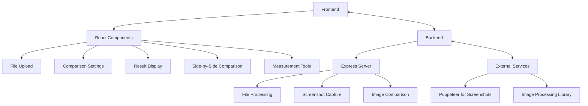
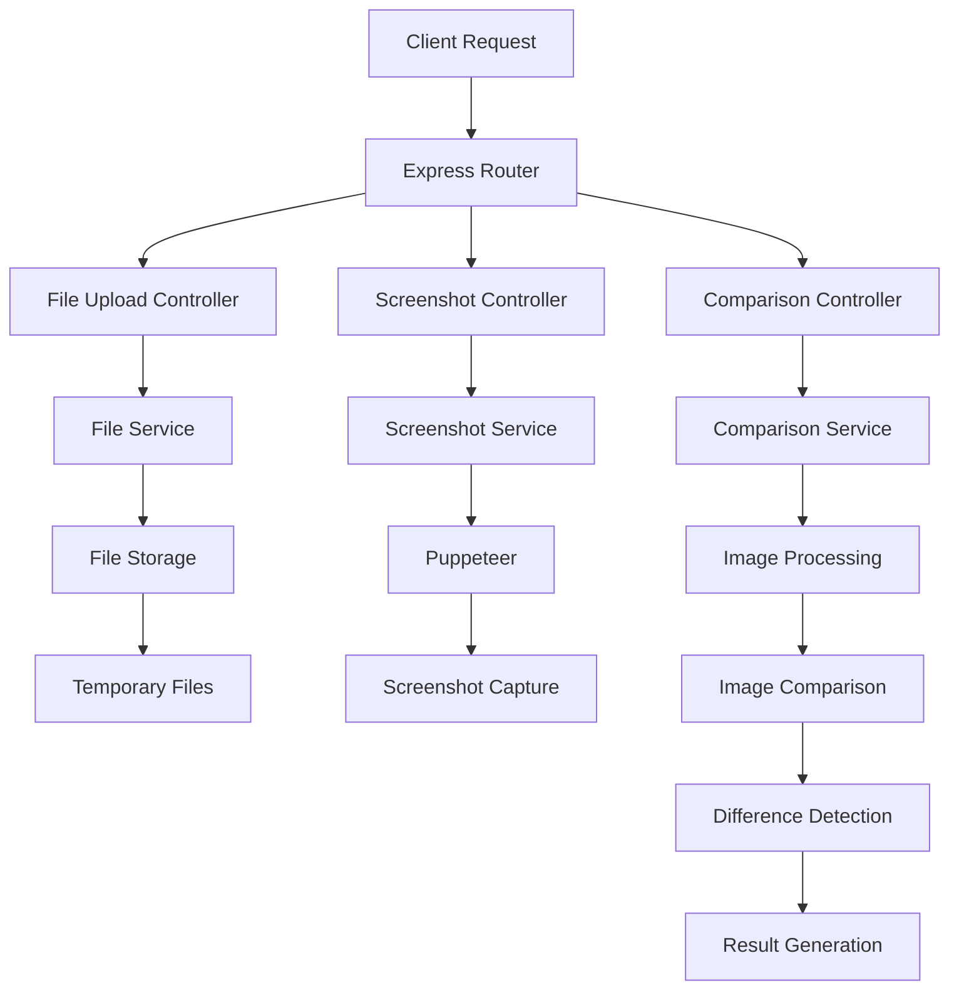

## 1. Architecture Design


## 2. Technology Description
- Frontend: React@18 + TypeScript + Tailwind CSS@3 + Vite
- Initialization Tool: vite-init
- Backend: Express@4 + Node.js
- Database: None (file-based storage for temporary files)
- External Services:
  - Puppeteer for capturing mobile page screenshots
  - Sharp for image processing
  - pixelmatch for image comparison

## 3. Route Definitions
| Route | Purpose |
|-------|---------|
| / | Home page with file upload and comparison settings |
| /result | Detailed comparison result page |

## 4. API Definitions
### 4.1 POST /api/upload
- **Purpose**: Upload design file
- **Request**: Multipart form data with file
- **Response**: 
  ```typescript
  {
    success: boolean;
    filePath: string;
    fileName: string;
  }
  ```

### 4.2 POST /api/capture
- **Purpose**: Capture screenshot of mobile page
- **Request**: 
  ```typescript
  {
    url: string;
    deviceType: string;
    screenSize: string;
  }
  ```
- **Response**: 
  ```typescript
  {
    success: boolean;
    screenshotPath: string;
  }
  ```

### 4.3 POST /api/compare
- **Purpose**: Compare design with screenshot
- **Request**: 
  ```typescript
  {
    designPath: string;
    screenshotPath: string;
    sensitivity: number;
  }
  ```
- **Response**: 
  ```typescript
  {
    success: boolean;
    comparisonPath: string;
    differences: {
      total: number;
      details: Array<{
        x: number;
        y: number;
        width: number;
        height: number;
      }>;
    };
  }
  ```

## 5. Server Architecture Diagram


## 6. Data Model
### 6.1 Data Model Definition
Not applicable for this project as we're using file-based storage for temporary files.

### 6.2 Data Definition Language
Not applicable for this project as we're not using a database.

## 7. File Structure
```
├── src/
│   ├── components/
│   │   ├── FileUpload.tsx
│   │   ├── ComparisonSettings.tsx
│   │   ├── ResultDisplay.tsx
│   │   ├── SideBySideComparison.tsx
│   │   └── MeasurementTools.tsx
│   ├── pages/
│   │   ├── Home.tsx
│   │   └── Result.tsx
│   ├── hooks/
│   │   ├── useFileUpload.ts
│   │   ├── useScreenshotCapture.ts
│   │   └── useComparison.ts
│   ├── utils/
│   │   ├── api.ts
│   │   └── imageUtils.ts
│   ├── App.tsx
│   ├── main.tsx
│   └── index.css
├── api/
│   ├── routes/
│   │   ├── upload.ts
│   │   ├── capture.ts
│   │   └── compare.ts
│   ├── services/
│   │   ├── fileService.ts
│   │   ├── screenshotService.ts
│   │   └── comparisonService.ts
│   ├── app.ts
│   └── server.ts
├── public/
│   └── temp/
├── package.json
├── tsconfig.json
├── vite.config.ts
└── tailwind.config.js
```

## 8. Technical Constraints
- Maximum file size for uploads: 10MB
- Supported file types: PSD, PNG, JPG, JPEG
- Maximum comparison resolution: 1920x1080
- Screenshot capture timeout: 30 seconds
- Temporary files are automatically cleaned up after 24 hours

## 9. Performance Considerations
- Image comparison is CPU-intensive, so we'll use worker threads for processing
- Screenshots are captured in headless mode to reduce resource usage
- File uploads are streamed to avoid memory issues with large files
- Caching of comparison results for repeated comparisons with the same parameters

## 10. Security Considerations
- All uploaded files are scanned for malicious content
- Temporary files are stored in a secure directory with restricted access
- CORS is configured to allow only specific origins
- Input validation for all API requests
- Rate limiting to prevent abuse of screenshot capture functionality